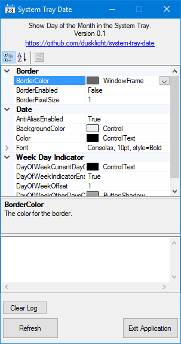

# System Tray Date

## Description
A small and simple Windows utility written in C# that shows day-of-the-month in the system tray.

It was built for a very specific use case:
* It's for people who runs the task bar in small icons mode, but still want to see the date on the tray.  (Windows system tray removes the date and only shows the time when running in small icons mode.)

There's no timer (in an effort to minimize using as little CPU resource as possible), so the date will not refresh on midnight, but it does detect session switch and power mode change.  Timer may be added in the future.

Screenshot of the main window for settings:

## Usage Notes
* Windows will show the date in the tray when the program starts, but hide the icon shortly afterwards.  It is necessary to drag the icon to the always visible section of the tray, and Windows will remember the setting next time the program starts.
